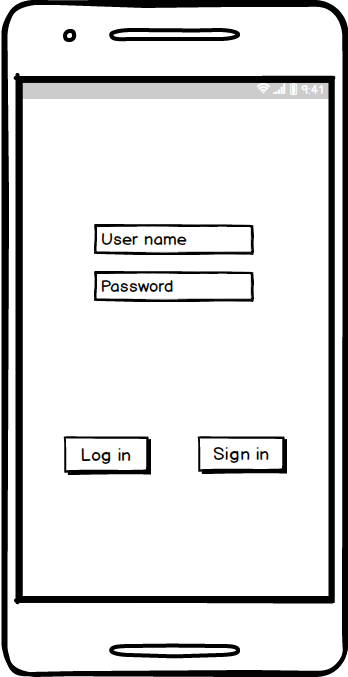
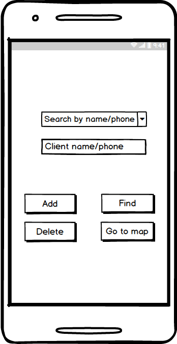
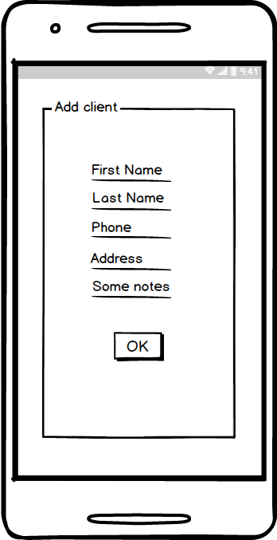
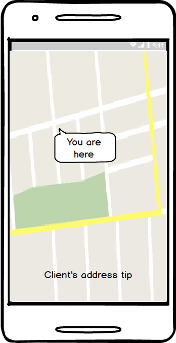

# Requirements Document
---

# 1 Introduction

 This document describes the functional and non-functional requirements for the "ClientMapping" application for the Android platform, which will allow users who have their own customer base to save time when working with client data. The database may contain the following information about customers: name, surname, address and telephone number. Also, this application will allow to travel to customers' users through interaction with the Google Maps service. Also this application will make possible showing user and customers location by means of interaction with the Google Maps service.

## 2  User Requirements

### 2.1 Software Interfaces

The application will be written in Java using the Android Studio integrated development environment (IDE) to work with the Android platform and will interact with the Google Maps service.

### 2.2 User Interfaces

When you start the application, you will be asked to register or log in to your account if the user has previously been registered. Then it is possible to add new customers to the database, delete irrelevant customers, change customer data and go to Google Maps with the ability to enter the customer address.

- User Authorization Screen
  
- Client Database management Screen
  
- Adding new customer screen
  
- Screen of redirecting to Google Maps service with display of a current location and client address
  

### 2.3 User Characteristics

The target audience is individual entrepreneurs and companies that work with the client base (including using the location of their clients) and want to structure and organize their work in the most convenient way.

## 2.4 Assumptions and Dependencies

Older Android versions may not support this application. Also without an Internet connection, users will be limited in their actions due to the application uses Goodle Maps to download maps and determine the current location.

# 3 System Requirements

To run the application, you need a mobile device with Android operating system version 4.0 and higher.

## 3.1 Functional Requirements

|Functions| Requirements |
|--|--|
|User registration| The application must request a login and password to register a new user 
|User initialization|The application provides the ability to log in after checking user data for correctness
| Add clients to the database|Applications allows each user to create a client database and add new ones
Search customers in the database|The application allows you to search for customers based on existing information
Change client's data|The application allows you to change client's data using search function
|  Remove from base| The application allows you to remove irrelevant clients from the database
| Redirecting to Google Maps servis| The application allows you to interact with the Google Maps service. When you click on the appropriate button, the application will redirect the user to the service, put a label at its current location, and the client’s address will appear in a pop-up window

## 3.2 Non-Functional Requirements

### 3.2.1 Software quality attributes

-   **Security**. This is an android application, and its data is stored in a database on the phone. These data can be obtained only by hacking or by picking up the phone.
-    **Reliability**. It is necessary to provide for user error handling. The user will be limited in their actions. When initializing a user, it is necessary to provide for a validation of the entered data. Also, in case of emergency situations in the system, all data that has been added to the database will be saved.
-  **Usability**. Font size must be at least 14pt. The functional elements are contrasting with the window background.

### 3.2.2 Limitations and Exceptions
1. The application was developed to work with the Android platform;
2. User profile is stored locally in the database.
